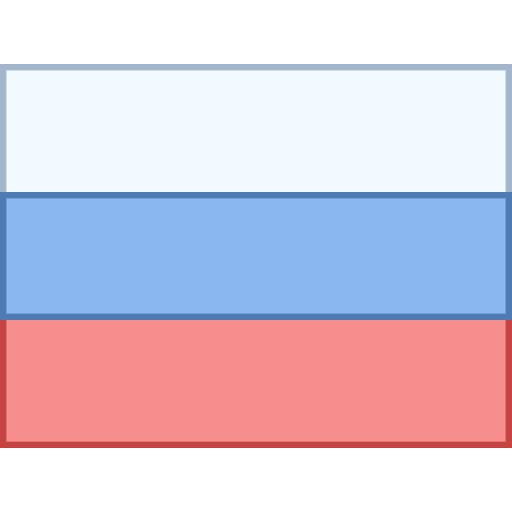

</img>

<table align="right">
 <tr><td><a href="README.md"> English</a></td></tr>
 <tr><td><a href="README_ru.md"> Русский</a></td></tr>
</table>

### :space_invader: &nbsp;Обо мне
&nbsp;&nbsp;&nbsp;:standing_person: &nbsp;Мне 26 лет. Разработчик Backend & ML/AI из Узбекистана.\
&nbsp;&nbsp;&nbsp;:technologist: &nbsp;На данный момент работаю учителем в [Codify](https://codifylab.uz/). \
&nbsp;&nbsp;&nbsp;:seedling: &nbsp;Люблю инновации и животных:dog:.\
&nbsp;&nbsp;&nbsp;:heartbeat: &nbsp;Увлекаюсь решением проблем и играми:video_game:.\
&nbsp;&nbsp;&nbsp;:writing_hand: &nbsp;На данный момент занимаюсь изучением новых технологий, а также оттачиванием уже имеющихся.\
&nbsp;&nbsp;&nbsp;:hammer_and_wrench: &nbsp;Программирую с 2021 (Backend).\
&nbsp;&nbsp;&nbsp;:family_man_man_boy: &nbsp;Нахожусь в Узбекистане :dog: :dog2:.

### :link: &nbsp;Как меня найти?

  &nbsp;&nbsp;&nbsp;&nbsp;
  &nbsp;&nbsp;&nbsp;&nbsp;
  &nbsp;&nbsp;&nbsp;&nbsp;
  &nbsp;&nbsp;&nbsp;&nbsp;
&nbsp;&nbsp;&nbsp;&nbsp;

### :computer: &nbsp;Стек

  
<b>:man_technologist: &nbsp;Что я использую</b>

   

&nbsp;
&nbsp;
&nbsp;
&nbsp;
&nbsp;
&nbsp;
&nbsp;
&nbsp;

&nbsp;
&nbsp;
&nbsp;
&nbsp;
&nbsp;
&nbsp;
&nbsp;
&nbsp;

&nbsp;
&nbsp;
&nbsp;
&nbsp;
&nbsp;
&nbsp;
&nbsp;
&nbsp;
&nbsp;
&nbsp;
&nbsp;

&nbsp;
&nbsp;
&nbsp;
&nbsp;
&nbsp;
&nbsp;

  
<b>:brain: &nbsp;Что я изучаю</b>

   

&nbsp;
&nbsp;
&nbsp;
&nbsp;
&nbsp;

&nbsp;
&nbsp;
&nbsp;
&nbsp;
&nbsp;
&nbsp;
&nbsp;

&nbsp;
&nbsp;
&nbsp;
&nbsp;
&nbsp;
&nbsp;
&nbsp;

&nbsp;
&nbsp;
&nbsp;

### :keyboard: &nbsp;Проекты

  
<b>:test_tube: &nbsp;Python (чистый)</b>

   
	<blockquote>Проекты на Python</blockquote>
	<ul>
		<li><a href="https://github.com/ggwmwgg/jb/tree/main/Arithmetic_HS" target="_blank">Arithmetic Exam Application</a></li>
		<li><a href="https://github.com/ggwmwgg/jb/tree/main/Calculator_HS" target="_blank">Smart Calculator</a></li>
		<li><a href="https://github.com/ggwmwgg/jb/tree/main/Easyrider_HS" target="_blank">Easy Rider Bus Company</a></li>
		<li><a href="https://github.com/ggwmwgg/jb/tree/main/Flashcards_HS" target="_blank">Flashcards</a></li>
		<li><a href="https://github.com/ggwmwgg/jb/tree/main/SCB_HS" target="_blank">Simple Chatty Bot</a></li>
		<li><a href="https://github.com/ggwmwgg/jb/tree/main/Zookeeper_HS" target="_blank">Zookeeper</a></li>
        <li><a href="https://github.com/ggwmwgg/cs50/tree/main/Py_Cash" target="_blank">Cash</a></li>
        <li><a href="https://github.com/ggwmwgg/cs50/tree/main/Py_DNA" target="_blank">DNA</a></li>
        <li><a href="https://github.com/ggwmwgg/cs50/tree/main/Py_Mario" target="_blank">Mario</a></li>
        <li><a href="https://github.com/ggwmwgg/cs50/tree/main/Py_Readability" target="_blank">Readability</a></li>
        <li><a href="https://github.com/ggwmwgg/jb/blob/main/TicTacToe_HS" target="_blank">TicTacToe</a></li>
        <li><a href="https://github.com/ggwmwgg/" target="_blank">More to come</a></li>
	</ul>

  
<b>:globe_with_meridians: &nbsp;Python (Web)</b>

   
<blockquote>Веб-приложения на Python</blockquote>
	<ul>
		<li><a href="https://github.com/ggwmwgg/cs50/tree/main/CS50_Final" target="_blank">My Portfolio Website (Flask)</a></li>
		<li><a href="https://github.com/ggwmwgg/cs50/tree/main/FLSK_Birthdays" target="_blank">Birthdays (Flask)</a></li>
		<li><a href="https://github.com/ggwmwgg/cs50/tree/main/FLSK_Finance" target="_blank">Finance (Flask)</a></li>
		<li><a href="https://github.com/ggwmwgg/jb/tree/main/Scraper_HS" target="_blank">Scraper</a></li>
		<li><a href="https://github.com/ggwmwgg/" target="_blank">More to come</a></li>
	</ul>

  
<b>:spider_web: &nbsp;Python (Async)</b>

   
<blockquote>Асинхронные приложения на Python</blockquote>
	<ul>
		<li><a href="https://github.com/ggwmwgg/tgbot" target="_blank">Telegram Bot Template</a></li>
		<li><a href="https://github.com/ggwmwgg/tgbot/tree/cafe_bot" target="_blank">Telegram for Cafe (example)</a></li>
        <li><a href="https://github.com/ggwmwgg/" target="_blank">More to come</a></li>
	</ul>

  
<b>:robot: &nbsp;Python (ML/AI (Soon))</b>

   
<blockquote>Python ML/AI</blockquote>
	<ul>
		<li><a href="https://github.com/ggwmwgg/" target="_blank">Soon</a></li>
		<li><a href="https://github.com/ggwmwgg/" target="_blank">More to come</a></li>
	</ul>

  
<b>:floppy_disk: &nbsp;Базы данных</b>

   
    <blockquote>Database проекты</blockquote>
	    <ul>
		    <li><a href="https://github.com/ggwmwgg/jb/tree/main/Calculator_for_Investors_HS" target="_blank">Calculator for Investors</a></li>
		    <li><a href="https://github.com/ggwmwgg/jb/tree/main/Food_Blog_Backend_HS" target="_blank">Food Blog Backend</a></li>
		    <li><a href="https://github.com/ggwmwgg/jb/tree/main/SCB_HS" target="_blank">Simple Chatty Bot</a></li>
		    <li><a href="https://github.com/ggwmwgg/jb/tree/main/Simple_Banking_System_HS" target="_blank">Simple Banking System</a></li>
		    <li><a href="https://github.com/ggwmwgg/jb/tree/main/TO_DO_List_HS" target="_blank">TO DO List</a></li>
		    <li><a href="https://github.com/ggwmwgg/cs50/tree/main/SQL_Movies" target="_blank">SQL Requests repo</a></li>
		    <li><a href="https://github.com/ggwmwgg/cs50/tree/main/FLSK_Birthdays" target="_blank">Birthdays</a></li>
		    <li><a href="https://github.com/ggwmwgg/cs50/tree/main/FLSK_Finance" target="_blank">Finance</a></li>
            <li><a href="https://github.com/ggwmwgg/tgbot/tree/cafe_bot" target="_blank">Telegram for Cafe (example)</a></li>
            <li><a href="https://github.com/ggwmwgg/" target="_blank">More to come</a></li>
	    </ul>

  
<b>:brain: &nbsp;Other</b>

   
<blockquote>Другие проекты</blockquote>
	<ul>
		<li><a href="https://github.com/ggwmwgg/cs50/tree/main/HCJs_Trivia" target="_blank">Trivia (HTML)</a></li>
		<li><a href="https://github.com/ggwmwgg/" target="_blank">More to come</a></li>
	</ul>

### :chart_with_upwards_trend: &nbsp;GitHub Статы

        

  
<b>:eight_spoked_asterisk: &nbsp;Other stats</b>

   
    

        
        
    

    </img>
<i>Особая благодарность <a href="https://github.com/brunotacca">@brunotacca</a> и <a href="https://github.com/Xx-Ashutosh-xX">@Xx-Ashutosh-xX</a> за идеи к этому README_ru.md</i>

